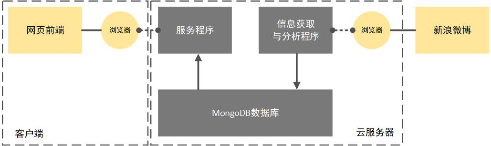

## 微情感-WEIBEMOTION

微博情感分析系统

### 1. 运行

#### a. 搭建运行环境

安装MongoDB (测试运行所用版本为  v4.0.14)、Python 3.7 和 Requirements.txt 中的包。

#### b. 导入示例数据

```bash
cd exampleSetter
python mongoSaver.py #此处通过localhost:27017连接MongoDB
```

#### c. 运行后台服务程序

```bash
python server.py #默认运行在localhost:8880
```

修改URL需要同步修改index.html和server.py中的地址。

### 2. 使用说明


①  “微情感”栏目可以切换显示感情倾向分布图与词云图，“热搜榜”栏目中有整个热搜榜五十个话题，点击相应话题添加显示，再次点击取消选择。

② 点击网页右上角的🔠也可获取相关信息。右侧的🎦点击后可以获取示例数据进行演示。

③ 热搜榜界面可以实时更新微博热搜，分为五页，每一页可提供十条微博热搜，具有翻页，批量选择热搜对比等功能。

### 3. 框架结构



 服务程序负责给前端投送页面，并响应前端的请求，从数据库中获取并组织情感数据，并根据数据库中存储的词语列表生成词云数据，发送给前端。

信息获取与分析程序（爬虫程序）定时运行，出于合法性的考虑，每个小时只运行一次，首先获取热搜榜，而后根据热搜榜上的话题，获取一轮数据。该程序驱动服务器上的浏览器“浏览”新浪微博，从而获取各个话题的相关微博，即时获取，即时计算分析得到相应的积极度，组织成约定的格式存入数据库。当该小时的热搜榜上的五十个话题相关的微博都已经获取完毕，爬虫程序将休眠至下一个小时。

### 4. 微博存储结构

某个话题的一系列微博存储为json格式

```json
{
  "cards": [//微博列表
    {
      "topic": "致敬无言的战士",
      "author": "央视新闻",
      "content": "【转发！#致敬无言的战士#】搜救犬沈虎，曾在汶川地震中救出15人；缉毒犬尔腾，曾参与执勤2982天缴毒100公斤；警犬卡拉完成任务后中暑倒地……它们是无言的战友，无怨无悔保家卫国。救灾、缉毒、反恐…哪里有危险，哪里就有它们的身影。转发，向无言的英雄致敬！",
      "reposts": "2667",
      "comments": "1038",
      "attitudes": "15000.0",
      "positive": 0.999988514112127 //积极度
    },
    .....
  ],
  "topic": "话题",
  "words": ["词语","列表"]
}
```

